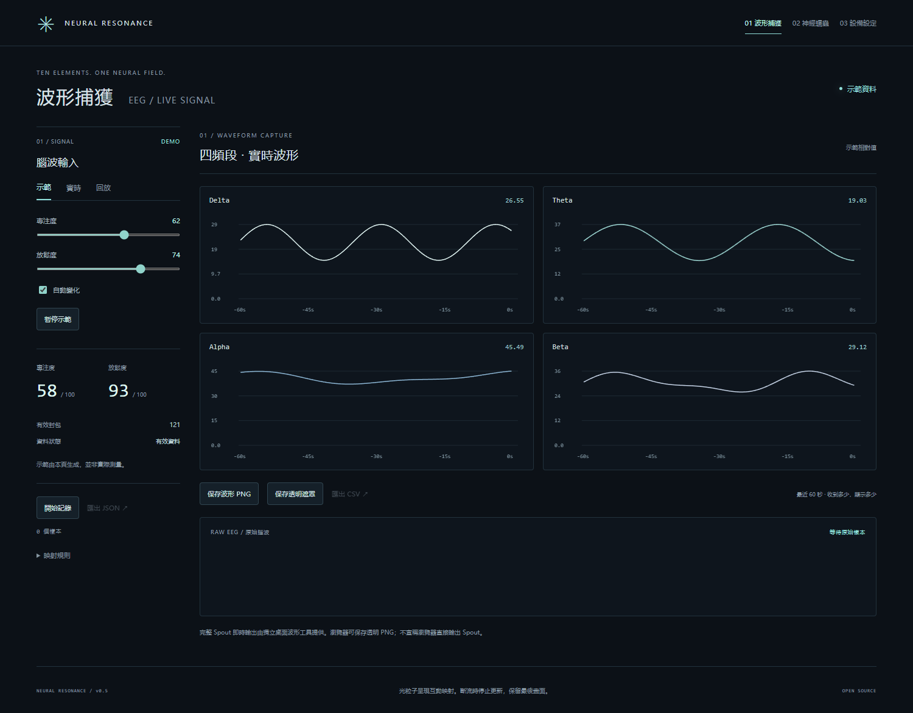
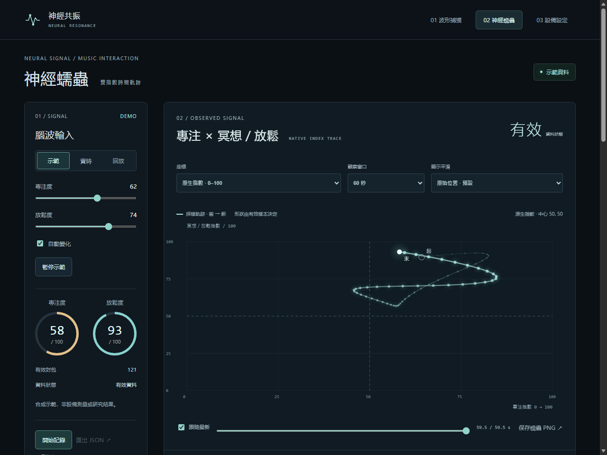

# 神經共振 / Neural Resonance

一個獨立運行的腦波交互前端，只有三個介面：

| 介面 | 可以做什麼 |
|---|---|
| **01 波形捕獲** | 看四頻段和原始腦波，記錄、回放，匯出 JSON／CSV，保存透明波形遮罩 |
| **02 神經蠕蟲** | 查看帶來源的雙指數時間軌跡、核對音樂觀測及缺失、匯出觀測摘要 |
| **03 設備設定** | 配置 USB／BLE／WebSocket，檢查瀏覽器與資料接口，匯入／匯出設定及上傳記錄 |

開啟網站立即顯示動態示範。切換三個介面共用同一份資料，
不需要作者的設備、路徑或後台，也沒有品牌顏色切換。





以上介面預覽使用合成示範。圖形與數值的逐項依據見[來源核對](docs/EVIDENCE.md)。合成示範只檢查交互，不作研究數據。

## 本地運行

### 直接使用設備：獨立應用

下載：[Windows x64](https://github.com/Sco-QianC01/neural-resonance-console/releases/latest/download/NeuralResonance-Windows-x64.zip) · [Mac M系列](https://github.com/Sco-QianC01/neural-resonance-console/releases/latest/download/NeuralResonance-macOS-arm64.zip) · [Mac Intel](https://github.com/Sco-QianC01/neural-resonance-console/releases/latest/download/NeuralResonance-macOS-x64.zip)。

Windows應用包解壓後，雙擊 **`NeuralResonance/NeuralResonance.exe`**。
它自帶隔離的Python環境、設備采集器及網頁，不需要Node、作者的音療系統或私人服務器。
USB按設備身份自動識別，端口變號或拔插後自動重試。可保存相容USB轉接器的VID/PID與序列號；BLE可保存地址／Mac UUID，改名後依身份識別。

macOS源碼版首次運行 **`Start-macOS.command`**，會在项目`.runtime/`內安裝固定依賴并打開本機網頁：

```sh
chmod +x Start-macOS.command
./Start-macOS.command
```

Windows源碼版使用PowerShell 7：

```powershell
.\Start-Windows.ps1
```

macOS应用包由仓库的 **Portable desktop packages** 工作流分别构建Apple Silicon和Intel版本。
首次蓝牙权限和缺失的厂商USB驱动按系统提示处理；真实Mac设备采集与应用构建分开验收。

完整安装步骤见[跨平台部署](docs/PORTABLE-DEPLOYMENT.md)，支持范围见[设备矩阵](docs/DEVICE-MATRIX.md)。
运行环境与自动化验收矩阵见[兼容范围](docs/COMPATIBILITY.md)。

### 只运行前端：Node或静态网站

安裝 Node.js 20 或更新版本：

```sh
git clone https://github.com/Sco-QianC01/neural-resonance-console.git
cd neural-resonance-console
npm start
```

開啟 `http://localhost:5173/`。不需要安裝 npm 依賴。
端口和監聽地址可改：

```sh
npm start -- --port 6123
npm start -- --host 0.0.0.0
```

第二種方式可讓同一區域網路的其他設備，使用此電腦的網路地址訪問。

## 接入設備

独立采集器默认支持ThinkGear相容脑电和AFE4490文本血氧／脉率。
默认配置没有作者USB序列号或固定COM号；同型号设备有多台时可在设备设置页选择身份。
其他厂商设备应先增加协议适配器或提供下面的标准JSON网关。

1. 在「實時」填入你自己的 WebSocket 資料源，按「連接」。
2. 使用直接 USB／BLE 接入時，在「設備設定」主動選擇設備並授權。
3. USB／BLE 接收器支援標準 ThinkGear 通知流。設備使用其他協議時，
   使用原廠驅動／你的橋接器解析後，再透過 WebSocket 接入。

瀏覽器硬體 API 依平台而異；BLE 需要正確的服務和通知特徵 UUID。
接口可用不等於設備已連接，網頁不會替你安裝系統驅動。
HTTPS 網站使用 `wss://`，本地 HTTP 頁面可使用 `ws://`。

詳見 [資料格式](docs/DATA-INPUT.md) 和 [設備接入](docs/DEVICES.md)。
連線恢復、四條縱向波形與來源時間戳見 [即時采集合同](docs/STREAM-RELIABILITY.md)。
`public/config.json` 可以配置啟動模式、資料源與自動連接。
預設不探測、不連接任何私人服務。

## 神經蠕蟲

借鑑演奏蠕蟲圖的「二維量值 + 時間軌跡」思路，
本頁採設備原生專注／冥想指數，或其0–127顯示換算；不從EEG生成速度／力度。
軌跡來自收到的樣本，不是遊戲目標或預先編好的游走路徑。

下方十項是旋律、節奏、和聲、力度、速度、調式、曲式、
織體、音色及演奏法的項目分組。創作方案由操作員選擇；音樂觀測需來源、分析方法、單位和同步時間，沒有資料的項目收起。

- [音樂觀測與證據要求](docs/MAPPING.md)
- [軌跡、座標與記錄](docs/NEURAL-WORM.md)

v0.11將三個入口放到左側，使用等比例畫布呈現時間軌跡。光粒子只表示採樣順序，展示模式不改變数据。

十要素提供課件第17–20頁的四套創作方案：舒緩、明快、沉靜、張力。方案與音樂觀測分開保存，沒有實測音樂時不補造值。見[創作方案](docs/MUSIC-PLANS.md)。
實時來源失效時停止游走，不自动切換示範。

### 把資料帶入音樂創作

在蠕蟲頁下方選擇觀察窗口與目標模型，按「整理摘要」。
可以複製文字到 ACE XL SFT、韶元、MiniMax 或 YuE2，
也可以匯出原始指數、來源、真實覆蓋時間和十項音樂觀測的 JSON。缺失項保持null。
目標選擇只記錄交接對象，頁面不呼叫模型；摘要分開保存創作意圖和來源音樂觀測。

提示詞僅使用當前來源、當前 session 的有效樣本；斷流時停用匯出。
原始設備指數保留 0–100，0–127 是另行導出的互動控制座標，
不是重新計算的腦電指數，也不會直接發送 MIDI。
示範、回放與實測來源都會保留在匯出內容中。

規則版本、來源時間及樣本間隔可用來重現一次交接。
觀測摘要不從EEG推算BPM、調式或情緒。手動創作方案會另外列出課件的音樂描述，保留方案身份、來源頁碼和選擇時間。

## 保存與部署

記錄先保留在目前頁面。下載 JSON／CSV 才保存到設備；
只有在設備頁明確按「上傳」才發送到你配置的 JSON POST 接口。
回放保留原始樣本間隔與缺值，不會自動補齊。

```sh
npm test
npm run build
```

把 `dist/` 部署到 GitHub Pages 或其他靜態託管平台即可。
GitHub Pages 入口 `/neural-worm/` 仍可直接打開蠕蟲介面。

| 位置 | 用途 |
|---|---|
| `neural-worm/app.mjs` | 三介面、資料接收、記錄與設定 |
| `src/eeg.mjs` | 格式、品質判斷與重連 |
| `src/waveform-view.mjs` | 時間波形、二維蠕蟲軌跡 |
| `src/music.mjs` | 帶來源、方法及單位的音樂觀測門禁 |
| `src/music-plan.mjs` | 課件創作方案、人工選擇和可匯入規則 |
| `src/prompt.mjs` | 有效窗口、觀測與缺失的手動交接 |
| `src/recording.mjs` | 保存原生指數、資料來源、單位與 CSV 匯出 |
| `src/neural-networks.mjs` | 十項音樂標注狀態，無預置幾何 |
| `src/research-sources.mjs` | 畫面研究來源及適用邊界 |
| `src/device-input.mjs` | USB／BLE 與 ThinkGear 解析 |
| `gateway/` | Windows／macOS独立采集、HTTP/WebSocket与依赖锁 |
| `Start-Windows.ps1`、`Start-macOS.command` | 首次安装及以后启动 |

Python设备采集器的测试与原生打包：

```sh
cd gateway
uv sync --frozen --group build
uv run python -m unittest discover -s tests -v
uv run pyinstaller package.spec --noconfirm --distpath ../artifacts/desktop
```

应用必须在目标操作系统原生打包；Windows虚拟环境不会直接复制到Mac。

協作方式見 [開發指南](docs/HANDOFF.md)。MIT 授權。
