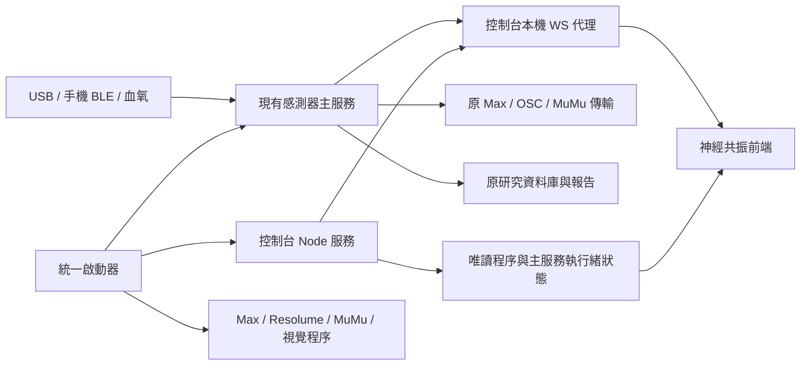

# 本地音療整合與驗證入口

統一入口位於：

```text
Q:\音疗系统\澳门科技大学\01_核心系统\music-therapy-pod-sensors\运行澳门版.ps1
Q:\音疗系统\澳门科技大学\02_启动与检查\启动\launcher-manifest.json
```

資料流程：



## 驗證命令（PowerShell 7）

```powershell
# 控制台單独啟動；既有主服務仍需运行
./tools/Start-Console.ps1 -Background
./tools/Invoke-Node.ps1 -NodeArguments @('--test','tests/eeg.test.mjs','tests/music.test.mjs','tests/sensors.test.mjs')
./tools/Invoke-Node.ps1 -NodeArguments @('tools/build.mjs')
./tools/Read-SystemStatus.ps1
```

本機整套程序啟動後，可執行 `tools/verify-local-integration.mjs`。
該腳本需要本機已安裝的 Playwright 和 Edge；
外部開發者可用 `PLAYWRIGHT_PATH`、`EDGE_PATH` 指定自己的路徑。
它先驗證真實主服務快照與程序狀態，再在瀏覽器測試受控資料。
受控資料只在測試瀏覽器內，不寫入主服務、不進入正式受試資料庫。

## 狀態邊界

- 「程序運行」由執行檔及所屬端口查詢得出。
- 「接口就緒」由 HTTP/API 查詢得出。
- 「資料接收」由感測器快照與計數進展得出。
- 音訊、投影、裝置佩戴、完整實驗報告各需對應的實際驗收。

主服務與控制台正常啟動不會自動開始療程、建立受試會話或播放聲音預覽。
手機 BLE 與 USB 的接入/切換仍由原系統處理；
控制台使用固定 loopback 接口，無需隨局域網 IP 改頁面地址。
