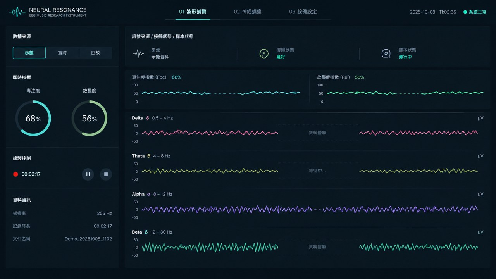

# GPT Image 2.5设计参考

通过用户指定的Suno HK页面选择GPT Image 2.5，实际提交并下载的设计图：

原图为1672×941像素，16:9构图。`image25-provenance.json`记录文件哈希与来源。

应用到前端的部分：深石墨与青白仪器风格、双环原生读数、分段来源按钮、状态栏和四条纵向通道。

不应用示例日期、采样率、µV及模型绘出的健康状态。前端始终使用真实字段及单位；缺失显示破折号，示范明确标记为示范。原图是一张设计稿，不是设备测量或软件截图。

## 提示词

High-fidelity desktop web UI for NEURAL RESONANCE, an EEG music research instrument. Dark graphite #0b1015, slate panels #101820, pale cyan-white typography, restrained mint accent. Elegant scientific instrument, precise spacing, no purple gradients, no theme switch. Exactly three top navigation items: 01 波形捕獲, 02 神經蠕蟲, 03 設備設定. Compact left panel with source tabs 示範 實時 回放, native readings 專注度 and 放鬆度, record controls. Large right instrument: source/contact/sample status strip, two native index traces, then FOUR vertically stacked full-width channels Delta Theta Alpha Beta with pink olive lilac mint traces, subtle axes and channel units. Display transparent real data gaps and waiting states. Luxurious yet usable research software, professional flat interface, readable Traditional Chinese, clean alignment, generous breathing room. No invented medical diagnosis, no advertising, no fake 3D browser, no decorative photos. Design one coherent screen.
